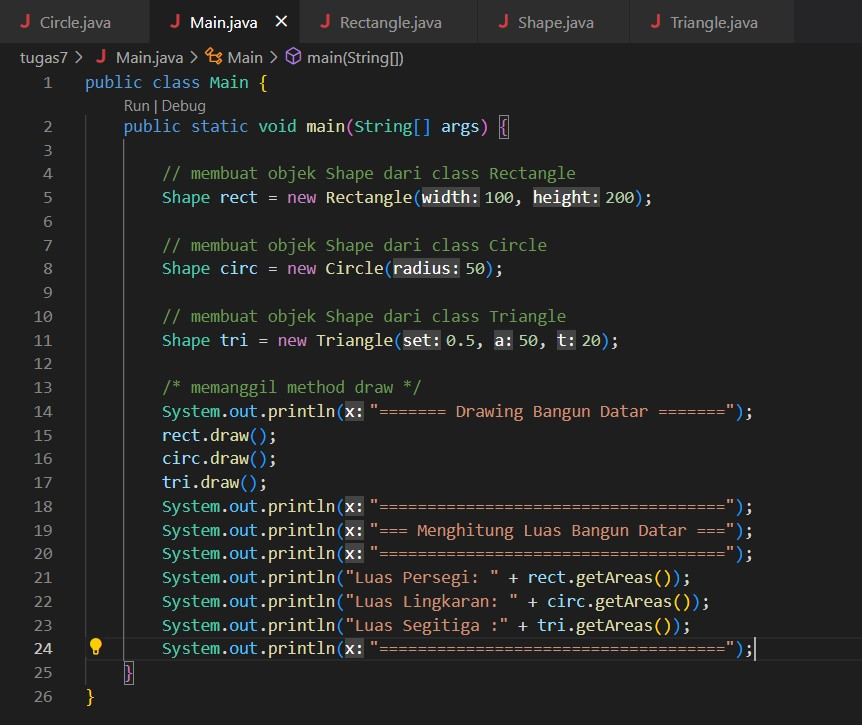

## LAPORAN PRAKTIKUM 6

# NAMA : IMAM SOLEHUDIN
# NIM : 312110290
# KELAS : TI.21.C.1
# MATA KULIAH : PEMROGRAMAN ORIENTASI OBJEK

# TUGAS !

![Gambar] (Screenshot/Soal.jpg)

- Buat abstract class BangunDatar dan lengkapi programnya sesuai diagram class tersebut.

1. Membuat Class bangun datar bernama Shape, pada class ini kita buat judul method dan parameter. Berikut Programnya    

2. Selanjutnya buat class persegi panjang bernama Rectangle pada class ini kita lakukan extend kepada shape karena class rectangel ini merupakan subclass. Tipe data yang digunakan yaitu float untuk menampilkan angka, disni kita juga melakukan Override kepada superclass. Setelah itu buat program untuk mencari luas dari Rectangle, rumus panjang x lebar (width*height). Berikut Programnya :

3. Buat class Lingkaran bernama Circle pada class ini kita lakukan extend kepada shape karena class Circle ini merupakan subclass. Tipe data yang digunakan yaitu float untuk menampilkan angka, disni kita juga melakukan Override kepada superclass. Setelah itu buat program untuk mencari luas dari Circle, untuk mencari luas lingkaran harus melakukan import math pada awal program agar bisa menggunakan rumus PI(3,14), rumus (PI*radius*radius). Berikut Programnya :

4. Buat class Segitiga bernama Triangle pada class ini kita lakukan extend kepada shape karena class Triangle ini merupakan subclass. Tipe data yang digunakan yaitu float dan double untuk menampilkan angka desimal, disni kita juga melakukan Override kepada superclass.Setelah itu buat program untuk mencari luas dari Triangle, rumus (setengah(0.5)*alas*tinggi). Berikut Programnya :

5. Terakhir buat class Main untuk menjalankan programnya. pada class main kita buat objek dari 3 class bangun datar yang sudah kita buat sebelumnya, lalu masukan nilai langsung didalam objek. Setelah itu buat program untuk memanggil draw dan memanggil Luas dari bangun datar yang sudah kita buat. Berikut programnya :

6. Hasil program

